# CadCore

Motor (kernel) de um software de desenho técnico vetorial 2D/3D inspirado no AutoCAD.
Esta é a **fundação**: o documento, a geometria, o índice espacial, as camadas e o
histórico undo/redo — tudo isolado de GPU e GUI, portanto **testável headless**.

## Arquitetura

Separação estrita **Document / View / Interaction**. `Entity` não conhece OpenGL:
emite primitivas para um `RenderBatch` que o backend gráfico consome depois.

```
src/
  core/            # KERNEL — sem Qt, sem OpenGL  (alvo: cadcore, STATIC)
    Types.hpp        EntityId
    math/            Vec, Matrix4, AABB, Ray  (double precision)
    geometry/        Entity (base abstrata), Line, Properties, RenderBatch
    spatial/         ISpatialIndex, Quadtree
    document/        DrawingManager (o Documento), Layer, LayerTable
    command/         Command, CommandStack, commands/ (Add, Delete)
  tools/           smoke_main.cpp  (alvo: cad_smoke — teste headless)
  app/             GUI Qt6          (alvo: cadapp — opcional, OFF por padrao)
```

### Decisões já tomadas
- **OpenGL 4.6** (não Vulkan) na v1: o gargalo dos 60 FPS é batching/culling, não a
  API. Backend fica atrás de uma interface para um Vulkan entrar depois.
- **Precisão dupla (double)** em toda a geometria.
- **Quadtree** com retenção de "straddlers" no nó pai (remove correto, sem duplicar).
- **Command + Memento**: cada comando guarda o necessário para se desfazer; ownership
  migra entre pilhas via `unique_ptr` (sem leak, sem `new`/`delete` manual).
- **ByLayer**: `Entity::resolveColor()` herda cor/lineweight da `LayerTable`.

## Build (headless — kernel + testes)

Requer um compilador C++20 + CMake. No Windows, com o VS 2022 Build Tools:

```bat
:: a partir de um "x64 Native Tools Command Prompt"
cmake -G Ninja -S . -B build
cmake --build build
ctest --test-dir build --output-on-failure
```

O teste `smoke` exercita inserção via Command, query espacial, picking, herança
ByLayer, emissão para RenderBatch e undo/redo. Saída esperada: `TODOS OS TESTES PASSARAM`.

## Build da GUI (viewport OpenGL 2D — requer Qt6)

```bat
cmake -G Ninja -S . -B build-app -DCADCORE_BUILD_APP=ON -DCMAKE_PREFIX_PATH=C:\Qt\6.8.3\msvc2022_64
cmake --build build-app --target cadapp
C:\Qt\6.8.3\msvc2022_64\bin\windeployqt.exe build-app\src\app\cadapp.exe
```

A janela abre com geometria de demonstração e duas formas de desenhar:

**Mouse** (barra de ferramentas): selecione **Linha** (clique 2 pontos, encadeia
segmentos) ou **Círculo** (clique centro e borda), com preview em tempo real
(amarelo). **Esc** ou botão-direito cancela. **Pan**: botão do meio (ou arrastar
no modo Selecionar). **Zoom**: roda.

**OSNAP**: o cursor é atraído magneticamente a pontos de interesse
(extremidade, meio, centro, quadrante) com um **glifo verde** — o clique "gruda"
no ponto exato, permitindo conectar geometria com precisão.

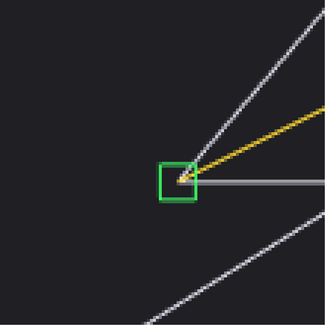

**Seleção & edição**: no modo *Selecionar*, clique nos objetos (**Shift** soma à
seleção) — ficam **cianos**. Ou arraste uma **caixa de seleção** (estilo AutoCAD):
- **Esquerda → Direita = Window** (azul sólida): só pega o que está **totalmente dentro**.
- **Direita → Esquerda = Crossing** (verde tracejada): pega tudo que a caixa **toca ou cruza**.

Use o painel **Modificar**: **Mover**, **Copiar**, **Rotacionar**, **Escalar**
(ponto-base e destino, com preview-fantasma), **Espelhar** (2 pontos do eixo →
cria cópia refletida) ou **Apagar** (botão / **Del**). Tudo entra no undo/redo.

Os comandos aceitam os **dois fluxos do AutoCAD**:
- **Noun-Verb**: selecione antes, depois acione o comando.
- **Verb-Noun**: acione o comando sem nada selecionado → ele pede "Selecione
  objetos", você seleciona e confirma com **Enter** ou **botão-direito**.

A linha de comando mostra o prompt da fase atual (selecionar / ponto-base / destino).

**Offset**: selecione 1 objeto (Line/Circle), confirme, e clique o lado/distância —
cria uma paralela/concêntrica.

**Precisão e UI**: grade adaptativa (espaçamento 1/2/5×10ⁿ conforme o zoom),
barra de status com **coordenadas vivas** e os toggles **SNAP / GRID / ORTHO**
(Ortho restringe o próximo ponto a horizontal/vertical), e ícones nos botões.

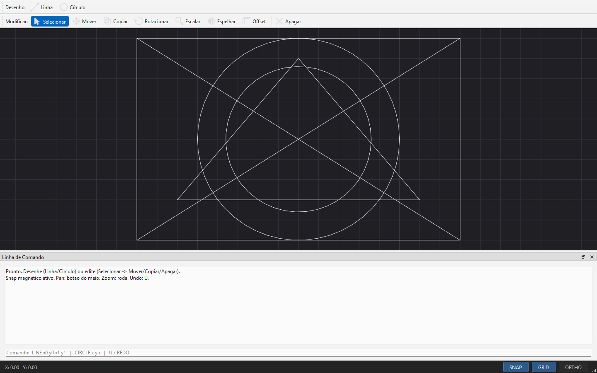

> _Trim e Fillet_: a geometria já está pronta em `core/edit/GeometryOps` — falta
> apenas a interação no viewport.

## Experiência AutoCAD

- **Linha de comando**: digite `L`/`LINE`, `C`, `REC`, `A`(arco), `M`, `CO`, `RO`,
  `O`(offset)… e **coordenadas**: `10,20` (absoluta), `@5,0` (relativa), `@10<45`
  (polar). `U`/`REDO` desfazem/refazem.
- **Mira (crosshair)** acompanhando o cursor e **entrada dinâmica** flutuante
  (comprimento, ângulo, dx, dy) durante o desenho.
- Ferramentas **Retângulo** (2 cantos) e **Arco 3 pontos**.

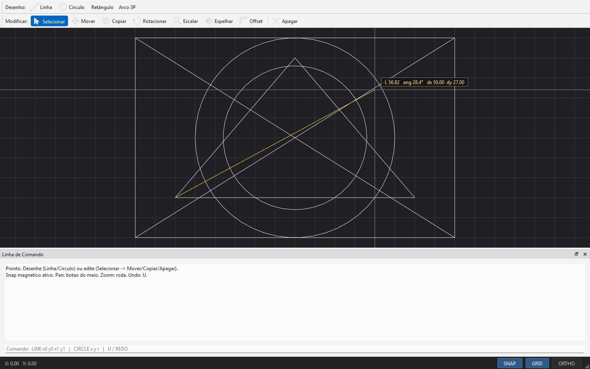

### Edição avançada, camadas e snaps

- **Trim** (clique a aresta de corte, depois as partes a remover) e **Fillet**
  (clique 2 linhas → arco de concordância, raio 10).
- **Snap de Interseção**: o cursor também gruda onde dois elementos se cruzam.
- **Digitar o tamanho**: durante um desenho, digite um número na linha de
  comando → o ponto vai a essa distância na direção do cursor.
- **Camadas**: painel lateral com cor por camada (o desenho colore por camada),
  visibilidade, camada corrente e "Nova camada".
- **Atalhos**: `L` Linha, `C` Círculo, `R` Retângulo, `A` Arco, `M` Mover,
  `O` Offset, `T` Trim, `F` Fillet.

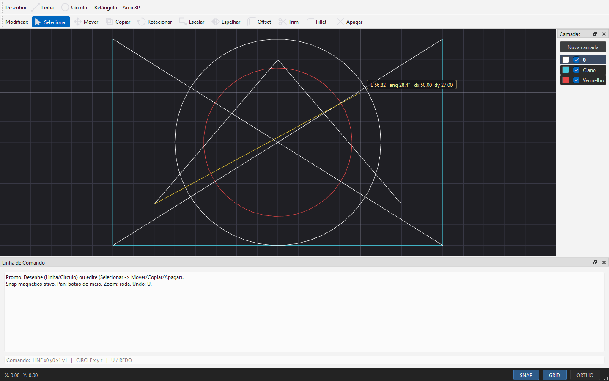

### Anotação técnica

- **Texto** (`MText`) com uma **fonte de traços** própria (vira segmentos, escala/rotaciona com o desenho).
- **Cotagem**: **Linear** e **Alinhada** (2 pontos + posição da linha), **Raio** e
  **Diâmetro** (centro + ponto), **Angular** (vértice + 2 lados) — com setas e texto
  da medida (ex.: `Ø36`, `45°`).
- **Hachura** (`Hatch`): clique numa polilinha fechada → preenchimento por linhas
  paralelas (clipping par-ímpar, respeita furos).


### Mais edição, criação e tipos de linha

- **Extend** (estender até um contorno), **Explodir** (polilinha → linhas),
  **Matriz** retangular e polar (via diálogo de parâmetros).
- **Elipse** (centro + eixo maior + eixo menor, com preview).
- **Tipos de linha** por camada: contínua, **tracejada**, **linha de centro**
  (traço-ponto) e **oculta** — aplicados no desenho conforme a camada.

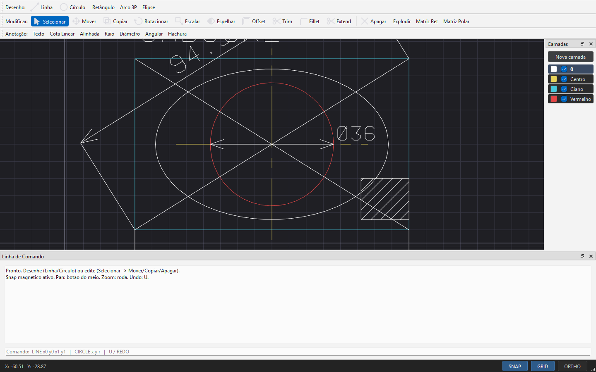

### Rastreamento (OTRACK) e camadas

- **Rastreamento**: ao desenhar, o cursor "adquire" pontos de referência (snaps e
  o último ponto). Quando você fica alinhado em X ou Y com um ref, surge uma
  **guia tracejada verde** e o ponto trava nesse alinhamento.
- **Painel de camadas** reescrito: criar camada, definir corrente (clique no
  nome), cor (clique no quadradinho) e visibilidade (checkbox).

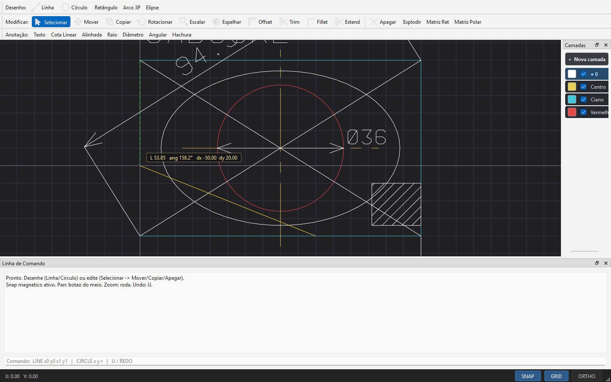

### DXF (export/import), chanfro e atalhos

- **DXF**: **Salvar DXF** grava o desenho em DXF ASCII (LINE/CIRCLE/ARC/
  LWPOLYLINE/TEXT/ELLIPSE + tabela de camadas) — abre no AutoCAD/LibreCAD; e
  **Importar DXF** lê um arquivo e traz as entidades para o documento. O
  round-trip (gravar → ler) é coberto pelo teste headless.
- **Chanfro**: clique 2 linhas → o canto vira um segmento reto (recuo 5).
- **Tipo de linha por camada**: cada linha do painel tem um seletor
  (Contínua/Tracejada/Centro/Oculta).
- **Atalhos de função**: **F7** grade, **F8** ortho, **F9** snap, **F11** otrack.

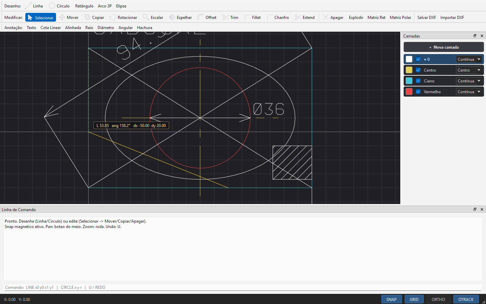

### Polilinha, Ponto, Spline, Grips, Stretch, Blocos e Plotagem

- **Polilinha / Spline**: clique vários pontos; **Enter** (ou botão-direito)
  finaliza. A Spline é uma Catmull-Rom que passa pelos pontos.
- **Ponto**: insere nós (marcador `+`), que também são pontos de captura.
- **Grips**: ao selecionar **uma** entidade aparecem alças azuis (extremos de
  linha, vértices de polilínha, centro/raio de círculo) — arraste para editar.
- **Stretch**: caixa Crossing (D→E), **Enter**, ponto-base e destino → estica só
  os vértices dentro da janela.
- **Blocos**: selecione objetos, **Enter**, clique o ponto-base → vira um bloco
  (uma entidade); copie-o para inserir mais instâncias.
- **Plotagem**: **Exportar PDF** gera um PDF vetorial (A4 paisagem, fit-to-page,
  cor por camada, linework branco → preto no papel).

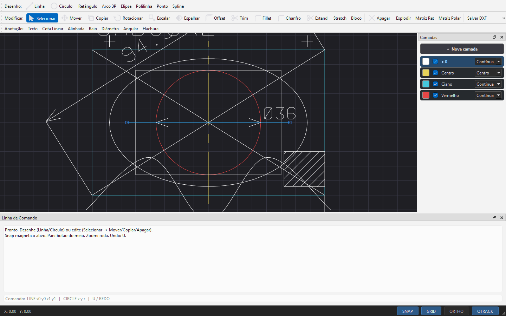

### Refinos de precisão (estilo AutoCAD)

- **Entrada dinâmica no canvas**: com um comando ativo, digite a **distância** ou
  a **coordenada** direto sobre o desenho (dígitos e `. , - @ <`) — aparece num
  balão junto ao cursor; **Enter** confirma. Letras seguem como aliases (L, C, R…).
- **Cursor**: a seta do SO some sobre o viewport; fica só a **mira** com um
  **pickbox** central (não há mais sobreposição com as linhas).
- **Marcadores de OSNAP por tipo**: Endpoint = quadrado, **Midpoint = triângulo**,
  Center = círculo, Quadrant = losango, Intersection = X.

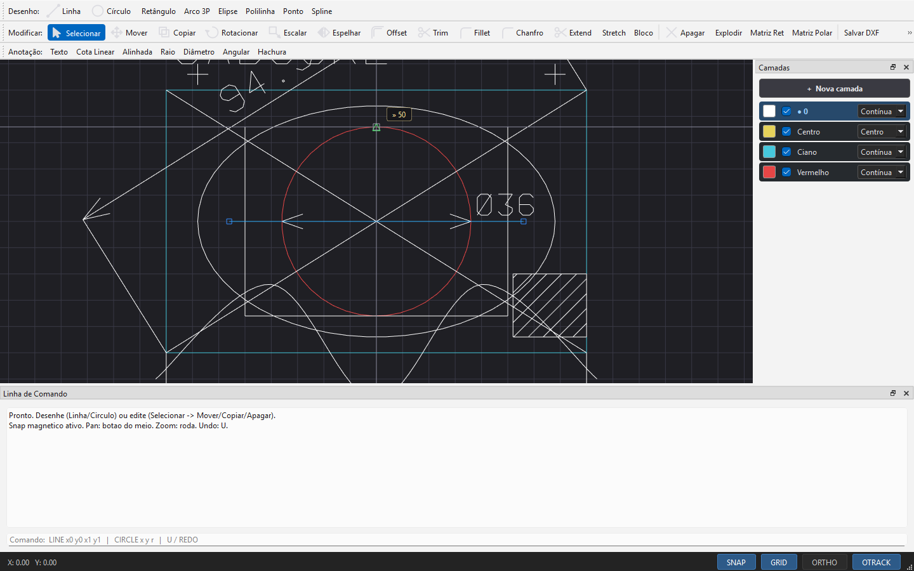

### Tema "Monolito High-Contrast"

Interface de alto contraste: painéis pretos, fundo do desenho cinza-chumbo
(`#1E1E1E`), bordas finas `#404040`, texto branco, acento **âmbar `#FFC400`**
(seleção, hover, pickbox) e prompts da linha de comando em **verde `#00FF41`**.
Menu no topo (Arquivo/Editar/Visualizar), **painel Propriedades** do objeto
selecionado, camadas em fonte monoespaçada e **zoom %** na barra de status.

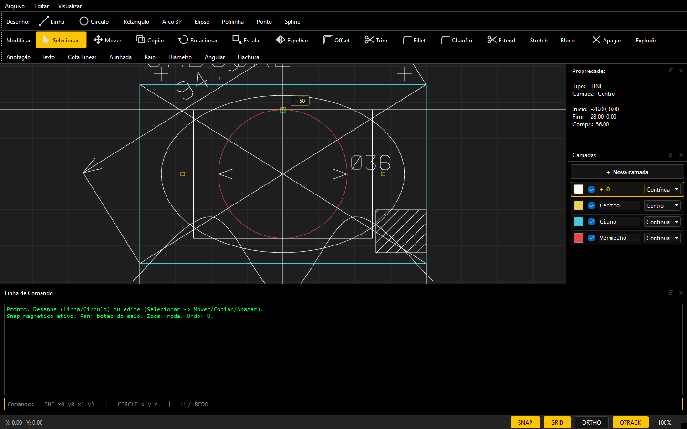

### Mais métodos de desenho (estilo AutoCAD)

- **Círculo 2P** (2 extremos do diâmetro) e **Círculo 3P** (passa por 3 pontos).
- **Arco Início-Centro-Fim** (além do Arco 3P).
- **Polígono** regular — **inscrito** ou **circunscrito**, nº de lados por diálogo.
- **Retângulo chanfrado** (cantos cortados).
- **Dividir** (N partes iguais) e **Medir** (a cada distância): clique a entidade
  e ela recebe pontos distribuídos por comprimento de arco (Line/Arc/Circle/
  Polyline/Spline).

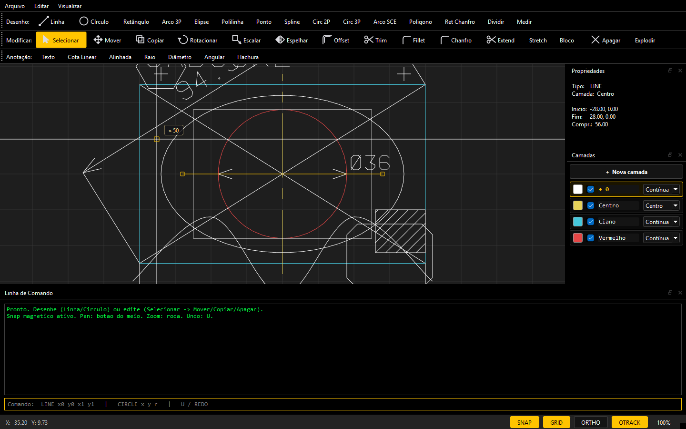

### Autocomplete de comandos (no cursor)

Comece a digitar um comando sobre o desenho e uma **lista filtrada** aparece
junto ao cursor (estilo AutoCAD AutoComplete). **↑/↓** navegam, **Tab** completa,
**Enter** executa. As letras digitadas viram comando (ex.: `L` + Enter = Linha),
e dígitos/coordenadas (`10,20`, `@5,0`, distância) continuam indo para a entrada
dinâmica.

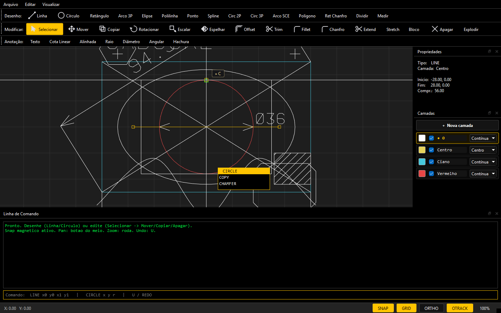

### Polilinha com arcos (bulge)

A `Polyline` suporta **arcos** por trecho via *bulge* (o mesmo fator do
LWPOLYLINE do DXF: `tan(ângulo/4)`). Isso habilita o **Retângulo arredondado**
(cantos em arco), o **Explode** que gera linhas + arcos, o **round-trip de DXF**
preservando o bulge (código 42) e o Dividir/Medir amostrando a curva.

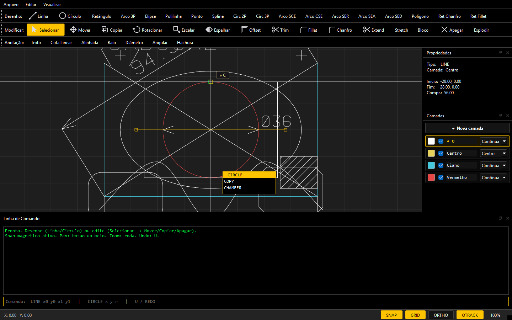

### Redesign "Aurora" + Círculo TTR + Spline CV

Tema visual novo (azul `#4f8cff`, fundo `#0b0d10`, cantos arredondados, fontes
Inter/JetBrains Mono) traduzido de um mockup, com **painel direito em abas**
(Propriedades/Camadas) e cores do viewport alinhadas (seleção/pickbox azul,
snap verde-água). Duas funções novas:

- **Círculo TTR** (Tangente-Tangente-Raio): informe o raio e clique 2 entidades
  (linhas/círculos) — cria o círculo tangente a ambas.
- **Spline CV**: clique os **pontos de controle** (a curva não passa por eles,
  é uma B-spline) — Enter finaliza.

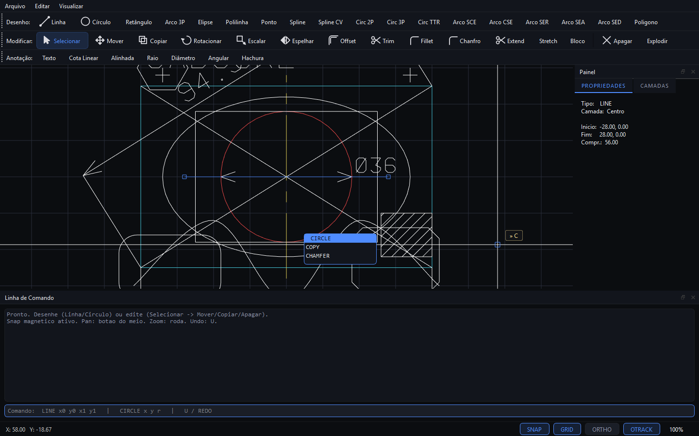

A interface foi finalizada com uma **barra vertical de ícones à esquerda**
(ferramentas comuns, line-art) e **menus no topo** (Desenho/Modificar/Anotação/
Arquivo) para as ferramentas especializadas — fechando o layout do mockup. Também
entraram **Arco elíptico** (trecho paramétrico da elipse) e **Círculo TTT**
(tangente a 3 retas: incírculo/excírculos).

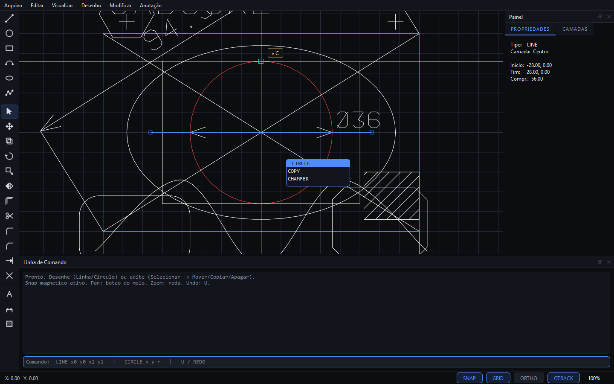

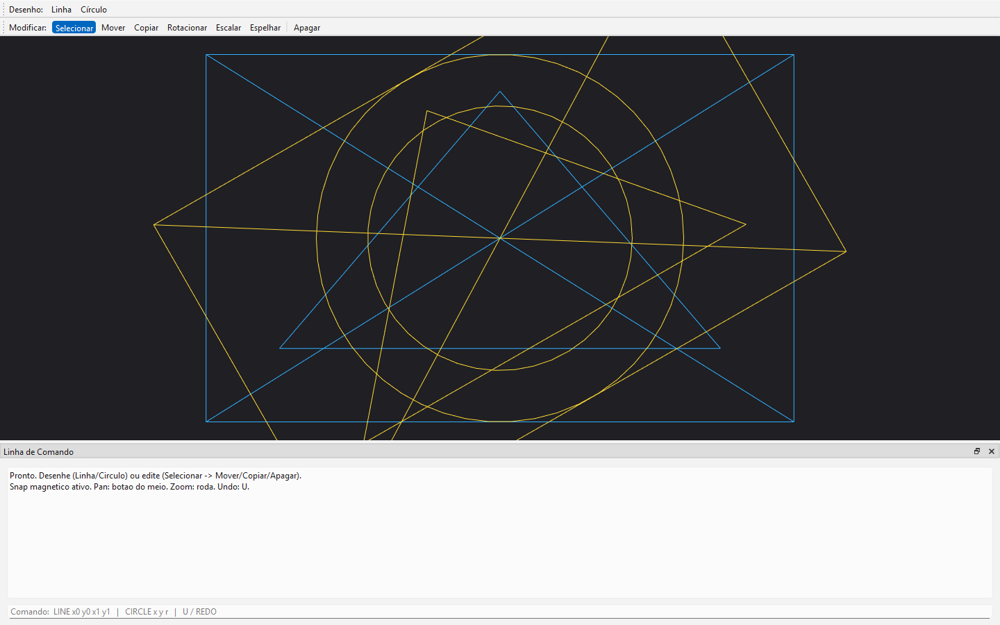

**Linha de comando**: `LINE x0 y0 x1 y1`, `CIRCLE x y r`, `U`/`UNDO`, `REDO`.

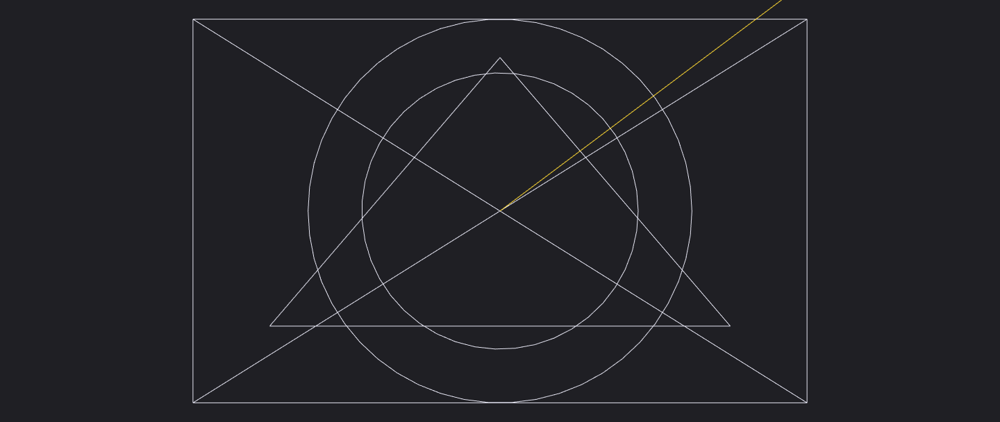

> A lógica das ferramentas vive no kernel (`core/interaction/ToolController`,
> sem Qt) — recebe pontos de mundo e comete via `Command` (entra no undo/redo).
> Por isso é testável headless; o viewport só converte mouse→mundo.

> Qt6 não precisa de instalador interativo: `pip install aqtinstall` e
> `python -m aqt install-qt windows desktop 6.8.3 win64_msvc2022_64 --outputdir C:\Qt`
> baixam binários prontos para o MSVC.
>
> **Verificação de render headless:** `cadapp.exe --shot saida.png` renderiza um
> frame do viewport e encerra — usado para validar o pipeline gráfico sem interação.

## Próximos passos
- Rumo ao 3D: `Octree` (mesmo `ISpatialIndex`), kernel BRep próprio.
- Shaders melhores: espessura de linha dinâmica, line_aa, faces sombreadas; LOD por zoom.
- Parâmetros na UI: raio de fillet / recuo de chanfro; escala de linetype; estilo de cota.
- DXF: exportar Hatch/Dimension, seção HEADER/handles, "abrir" substituindo o documento.
- Plotagem: Paper Space / múltiplas viewports, escala 1:N.
